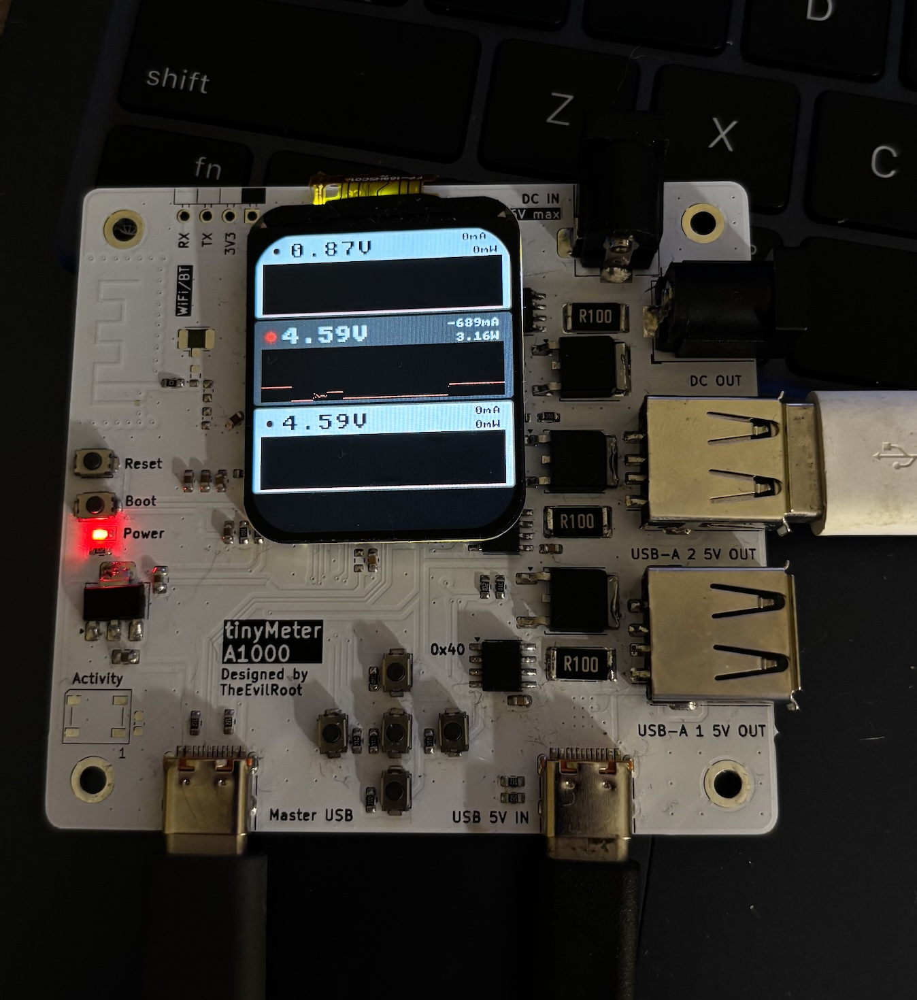

# tinyMeterOS 

Firmware for [tinyMeter A1000](https://github.com/TheEvilRoot/tinyMeter/tree/v1) boards for ESP32-S3 SoC.

Run with `idf.py flash` or `./idfrun.py /dev/cu.usbmodem-1100` for serial monitoring

